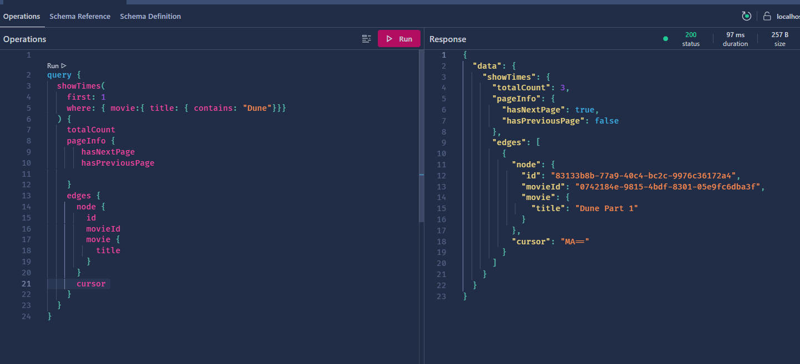
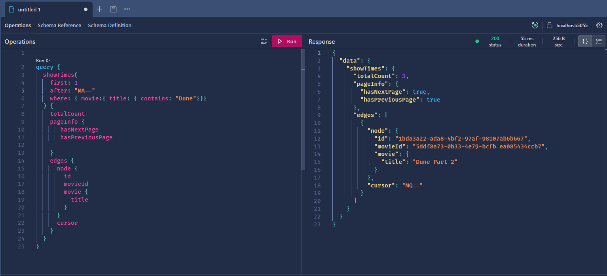

# Sample GraphQL API

This app is a sample API that exposes GraphQL. 
I utilized the Hot Chocolate NuGet package for this purpose. With this package, we can also filter the endpoints.

The implementation uses Minimal API. 

The server architecture follows a kind of Domain-Driven Design (DDD), and the database is in-memory for testing purposes.

When you start the app, you can use the built-in GraphQL playground by accessing http://localhost:5050/graphql/.

Here's an image of what you'll find:


## Selecting and Expanding

To create your first GraphQL query, you can use the following example:

C# code:

  public async Task<IQueryable<ShowtimeEntity>> GetAll()
  {
      var result = await showtimesRepository.GetAsync(default);
      return result.AsQueryable();
  }

Where All is the name of the entity in GraphQL.

```graphql
{
  all {
    id
    movieId
    movie {
      title
    }
  } 
}
```

Here's a sample of the result:


## Filtering

C# code:
```C#
        [UsePaging(IncludeTotalCount =true, DefaultPageSize =50)]
        [UseFiltering]
        public async Task<IQueryable<ShowtimeEntity>> GetShowTimes()
        {
            var result = await showtimesRepository.GetAsync(default);
            return result.AsQueryable();
        }
```
Where ShowTimes is the name of the entity in GraphQL.


```graphql

query {
  showTimes(
    first: 2
    where: { movie:{ title: { contains: "Dune"}}}
  ) {
    edges {
      node {
        id
        movieId
        movie {
          title
        }
    } 
    }
  }
}

```

Here's a sample of the result:


You can refer to the Hot Chocolate documentation for guidance on implementing filtering: [Hot Chocolate - Fetching Data: Filtering](https://chillicream.com/docs/hotchocolate/v13/fetching-data/filtering)

## Pagination

To provide pagination, you should add totalCount and pageInfo arguments to the query. 
Then, you should add a cursor to enable requesting the next page.


Page 1:

```graphql
query {
  showTimes(
    first: 1
    where: { movie:{ title: { contains: "Dune"}}}
  ) {
    totalCount
    pageInfo {
       hasNextPage
       hasPreviousPage
       
    }
    edges {
      node {
        id
        movieId
        movie {
          title
        }
      }
      cursor 
    }
  }
}
```


Page 2:
```graphql
query {
  showTimes(
    first: 1
    after: "MA=="
    where: { movie:{ title: { contains: "Dune"}}}
  ) {
    totalCount
    pageInfo {
       hasNextPage
       hasPreviousPage
       
    }
    edges {
      node {
        id
        movieId
        movie {
          title
        }
      }
      cursor 
    }
  }
}
```



For more information on pagination in GraphQL, you can visit [GraphQL Pagination](https://graphql.org/learn/pagination/)
